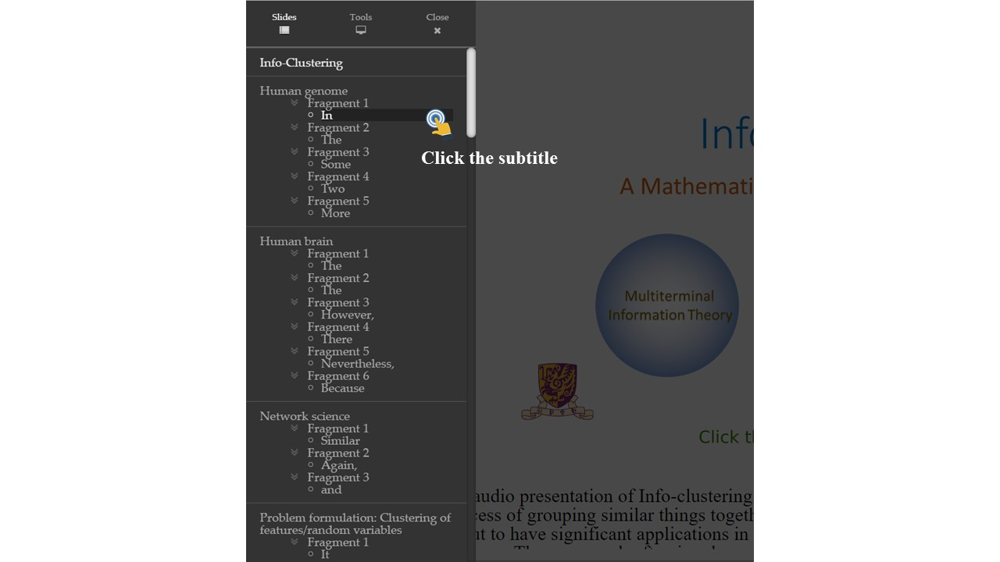
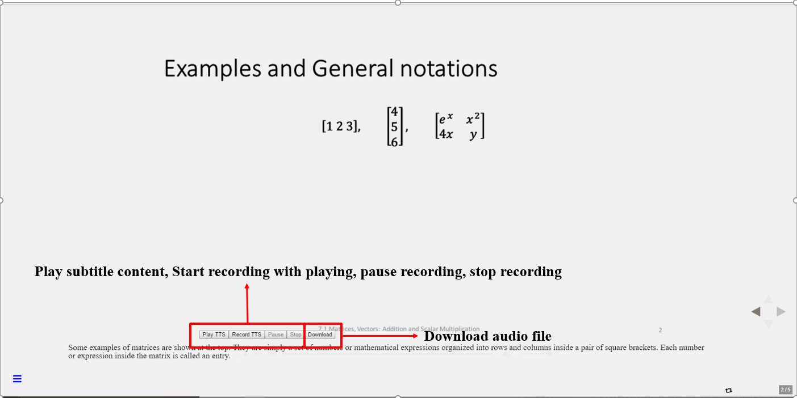
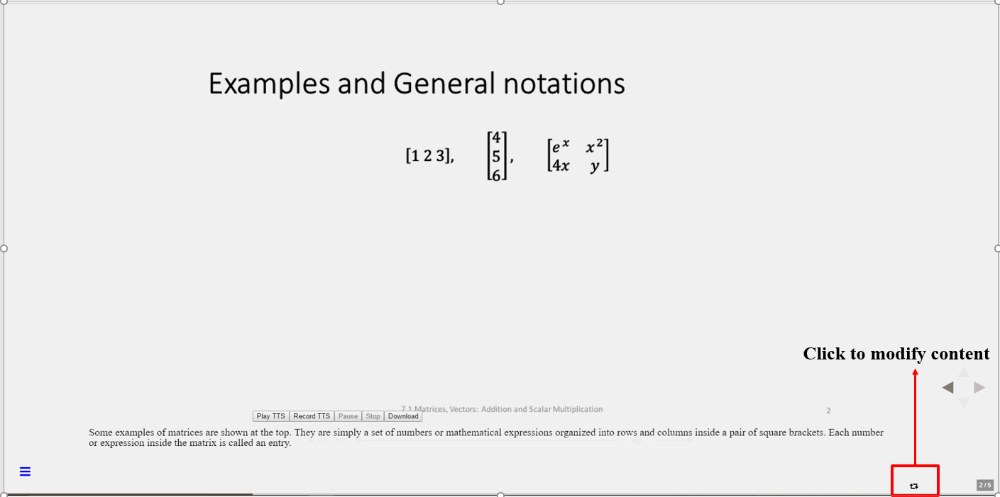
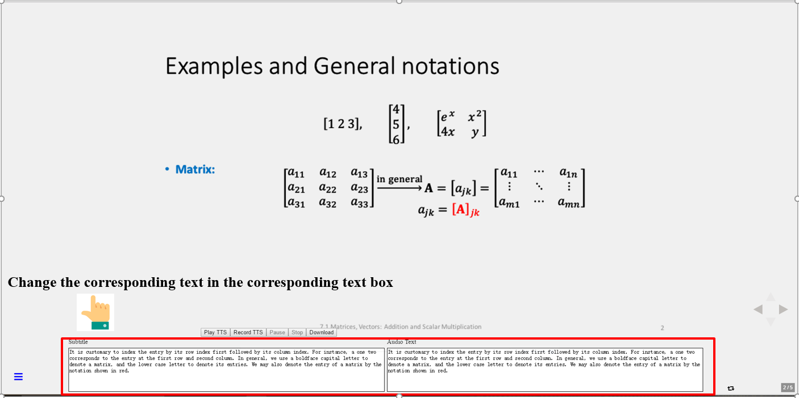
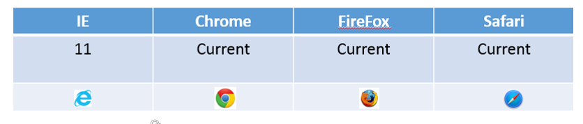
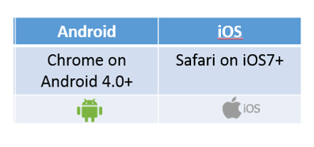

# Reveal.js -- extended version 

An extended version of [Reveal.js](https://github.com/hakimel/reveal.js). Based on reveal.js and its plugins, we fixed the existing bugs and add multiple features to enrich the user experience of reveal.js which includes subtitle for each slide, direct modification of subtitle in the web page, locally text-to-speech conversion in audio-slide-show, recorder to record and output corresponding audio for each slide, a much powerful menu with a few useful options.
[Check out the live demo](https://jimmygy.github.io/reveal/7.1)

## Installation

Check out and install reveal.js following (https://github.com/hakimel/reveal.js)

Replace ```reveal.js``` folder in the original reveal.js project with our ```reveal.js``` folder.

Add the following to the ```<head>``` in your HTML files:

```javascript
  <head>
	// ...

    <script type="text/javascript" src="../reveal.js/js/jquery-1.6.min.js"></script>
	<link rel="stylesheet" href="../reveal.js/css/not.the.skin.css">
	<link rel="stylesheet" href="../reveal.js/circle.skin/circle.player.css">
	<link type="text/css" href="../reveal.js/skin/blue.monday/css/jplayer.blue.monday.css" rel="stylesheet" />
	<script type="text/javascript" src="../reveal.js/js/jquery.transform2d.js"></script>
	<script type="text/javascript" src="../reveal.js/js/jquery.grab.js"></script>
	<script type="text/javascript" src="../reveal.js/js/jquery.jplayer.js"></script>
	<script type="text/javascript" src="../reveal.js/js/mod.csstransforms.min.js"></script>
	<script type="text/javascript" src="../reveal.js/js/circle.player.js"></script>
	<script>$.noConflict();</script>

	// ...
  </head>
```

Add the following to the dependencies in your HTML files:

```javascript
Reveal.initialize({
	// ...
	dependencies: [
		// ... 
	      { src: '../reveal.js/plugin/audio-slideshow-new/slideshow-recorder.js', condition: function( ) { return !!document.body.classList; } },				
	      { src: '../reveal.js/plugin/audio-slideshow-new/audio-slideshow.js', condition: function( ) { return !!document.body.classList && !Reveal.getConfig().tts; } },
	      { src: '../reveal.js/plugin/audio-slideshow-new/slideshow-reader.js', condition: function( ) { return !!document.body.classList && Reveal.getConfig().tts; } },
	      { src: '../reveal.js/plugin/subtitles/subtitles.js', condition: function( ) { return !!document.body.classList; } },
	      { src: '../reveal.js/plugin/timer/timer.js', condition:function() {return !!document.body.classList; } },
	      { src: '../reveal.js/plugin/record-screen/record_screen.js', condition:function() {return !!document.body.classList; } },
	      { src: '../reveal.js/plugin/math/math.js', async: true },
	      { src: '../reveal.js/plugin/menu/menu.js' },
		// ... 
	]
});
```

## Configuration

Our project has an optional parameter that you can set for your presentation which is similar to the parameter setting in the original reveal.js.
You can select the mode of your slides by setting ```tts```, true for editor mode, false for reader mode. Default is false.

```javascript
Reveal.initialize({
	// ...
	tts: false,
	// ...
});
```

## Reader mode

This mode is designed for slides which will be published to the users. In this mode, audio is pre-prepared. You need to put all the related audios to ```audio``` folder which locates in the same folder as your HTML files.

In this mode, you can set subtitle for each slide in your HTML files like the following, use ```data-audio-subtitle``` tag:
```html
 		<section 
             data-audio-subtitle="In this section, we will generalize concept of vectors even further to a structure called the matrix. Similar to the vectors, we can define some operations such as addition and multiplication. Such operations are called linear algebra. Linear algebra is widely used in engineering because it is capable of modeling many practical problems. It also provide simple and computable solutions to these problems. The google search engine, for instance, use linear algebra to compute the page rank of the web pages.">
        <h3 style="display:none;">Matrices, Vectors</h3>
        	        <div data-svg-fragment="svg/0.svg#[*|label='Layer 1']">
	            	</div>
	    </section>
```

After all things are set up, user can see an interface like the following:
 

User can play the audio using the audio player in each slide. Meanwhile, user can also record their own voice to replace the original audio by clicking the ```record``` button. ```pause``` and ```stop``` button are used for pausing and finishing the recording. ```Download``` button is used for downloading the audio file. 

User can open the menu as below:

 

User can go to any position of the slides by clickng the corresponding subtitle, as below:



Furthermore, you can use some optional tools in the ```Tools``` option in the menu, as below:


```subtitle``` button is used for enabling/disabling subtitle.

```font``` button is used for changing the font size of subtitle.

```timer``` button is used for enabling a timer in the slides.

## Editor mode

This mode is designed for preparing slides. It has all features in reader mode and some advanced features helping user prepare the slides much easily. The interface is the following:

 

In this mode, you can also set subtitle for each slide in your HTML files using ```data-audio-subtitle``` tag. Additionally, you can also set the audio text which will be convert to the audio for each slide in your HTML files using ```data-audio-text``` tag, as below:
```html
 		<section 
             data-audio-subtitle="In this section, we will generalize concept of vectors even further to a structure called the matrix. Similar to the vectors, we can define some operations such as addition and multiplication. Such operations are called linear algebra. Linear algebra is widely used in engineering because it is capable of modeling many practical problems. It also provide simple and computable solutions to these problems. The google search engine, for instance, use linear algebra to compute the page rank of the web pages."
			 data-audio-text="In this section, we will generalize concept of vectors even further to a structure called the matrix. Similar to the vectors, we can define some operations such as addition and multiplication. Such operations are called linear algebra. Linear algebra is widely used in engineering because it is capable of modeling many practical problems. It also provide simple and computable solutions to these problems. The google search engine, for instance, use linear algebra to compute the page rank of the web pages.
			 "
             >
        <h3 style="display:none;">Matrices, Vectors</h3>
        	        <div data-svg-fragment="svg/0.svg#[*|label='Layer 1']">
	            	</div>
	    </section>
```
In this mode, text-to-speech conversion is finished locally, you can change the tone, rate, pitch, volume of the audio generated by the text-to-speech API in the ```Tools``` option in the menu.

User can use ```playTTS``` button to preview the audio generated by the text-to-speech API. If everything goes well, user can use ```recordTTS``` button to record the generated audio. ```pause``` and ```stop``` button are used for pausing and finishing the recording. ```Download``` button is used for downloading the audio file. Then, user can put these audio files in the ```audio``` folder to create ```reader mode``` slides.

If you find that some contents in the subtitle is incorrect, you can modify it directly in the web page like the following:

Click to enter the editor:
 

Edit the subtitle and audio text directly in the web page:

 

After that, user can generate the audio one more time as mentioned above.

## Compatibility
Our project supports the following broswer:
 

Our project supports the following portable device:
 

## License

MIT licensed

Copyright (C) 2017 ZHANG ZIXING, GUO YANG